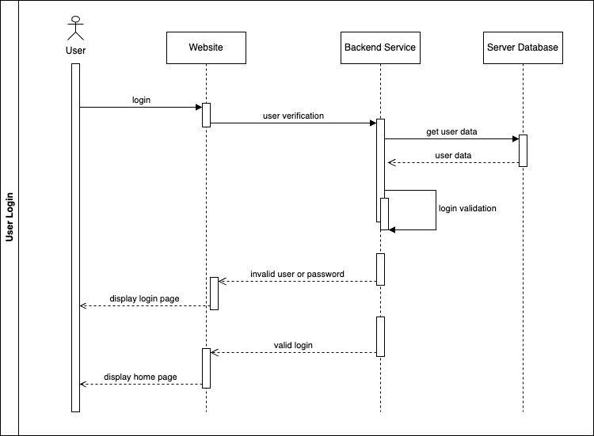
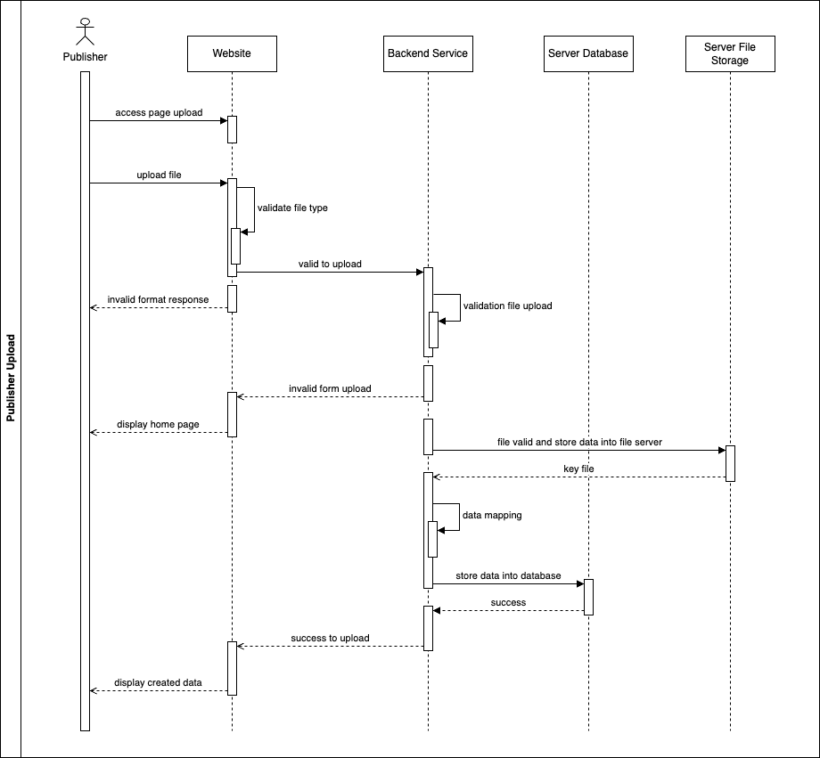
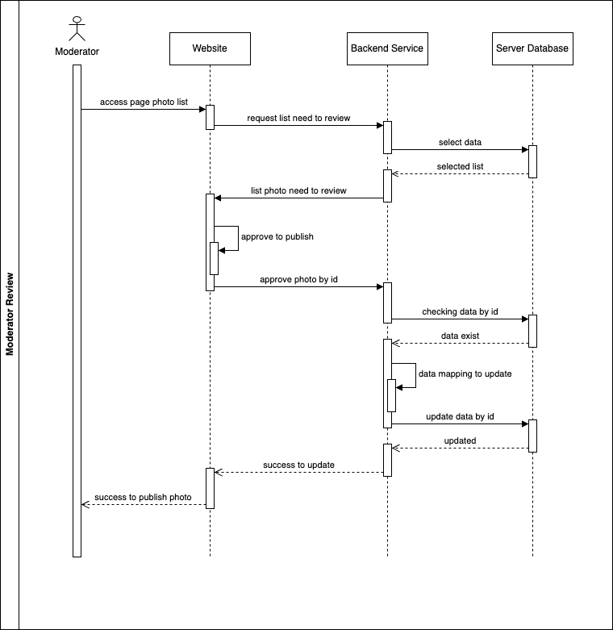
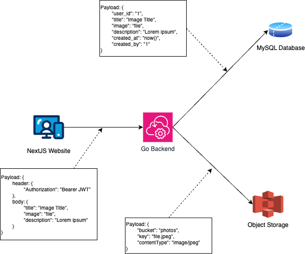

Question:
Imagine you're building a website that allows users to submit photos. One of the requirements is that each photo must be reviewed by a moderator before it can be published. How would you design the logic for this process? What technologies would you use? Do you have any data structure in mind to support this based on your technology of choice to handle those data?

Answer

### Design Flow Chart

#### Publisher

User logged in as publisher accessing the photo upload page, then upload the file and fillup other field. After success with frontend form validation, data submited to backend then store data into database and file to object storage.

#### Moderator

User logged in as moderator accessing the list of data to do review incoming or existing data. Moderator select the data then click action review. After complete the review, user submit as published action then the data will be updated the status to "published".

### Sequence Diagram

#### Sequence Login

User send request to login to website, in website user do fill up the forms and submit the request login. The website proceed request login to the backend service, the backend services will check username and password exist in database. After getting data user from database, the backend will validating encrypted user input password and match it the password from database. The backend service send response as success or failed to website then the website provides alert based on backend response representation. 

#### Sequence Publisher

Loggedin user publisher access the page upload photo to submit file and photo detail, after that user do upload file or submit the request. The webiste do validate request body before send to backend. If the data is valid, website proceed the request to backend. In the backend, data request must be revalidate based on defined struct. After validate process, backend upload a file into object storege. Response success from object storage will be standard logic to proceed store data profile into database. 

#### Sequence Moderator

Loggedin user moderator request access the photo list in the website, then the webiste request data photo list to backend with filter need to review. The backend provided list photo to send as response to website. Moderator select the data to make review and publish, user send request to backend after completed review. The backend checking data request to database, then update the selected data after check if data is exist. 

### Architecture and Technolgy

#### Architecture

#### Technolgy

1. NextJS as frontend framework
With next js easy routing and image optimization
2. Golang as backend service 
With GO can use with simple project, easy to deploy, very light and no runtime.
3. Mysql as database
Compability, open source and have simple query.
4. Object Storage as object database
No manual configration to secure file directory.